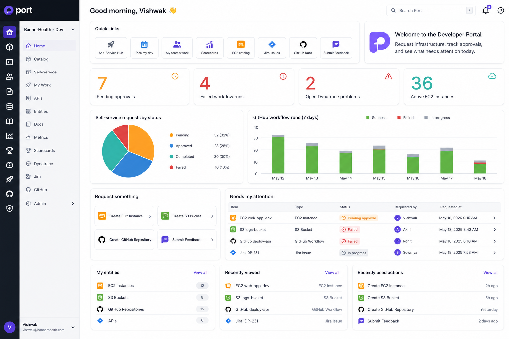
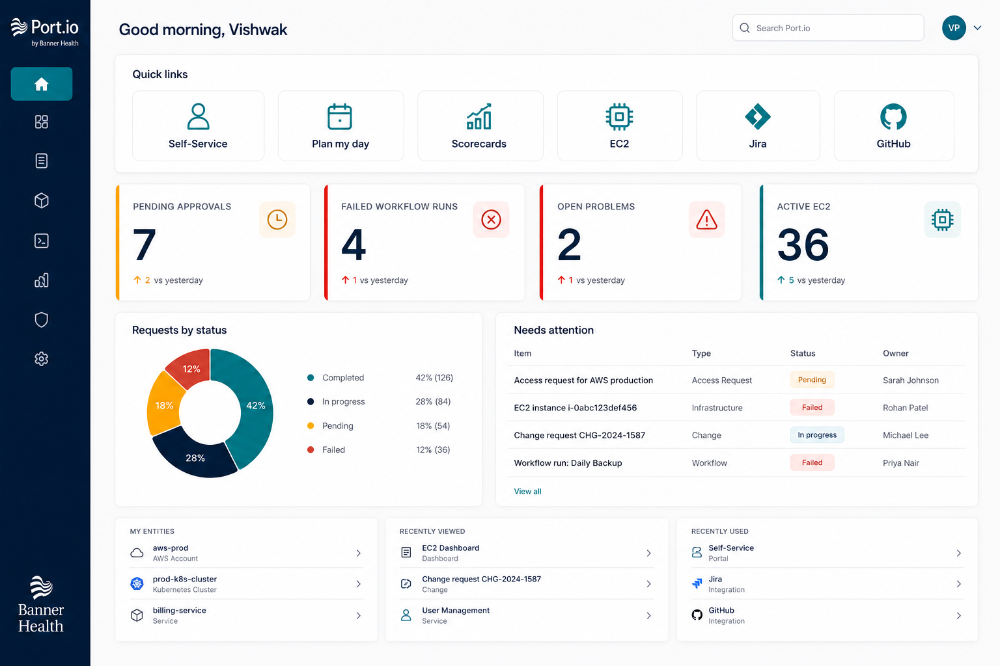
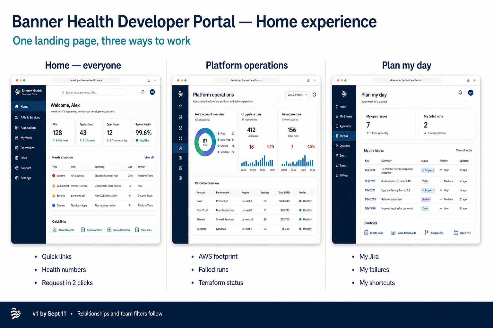
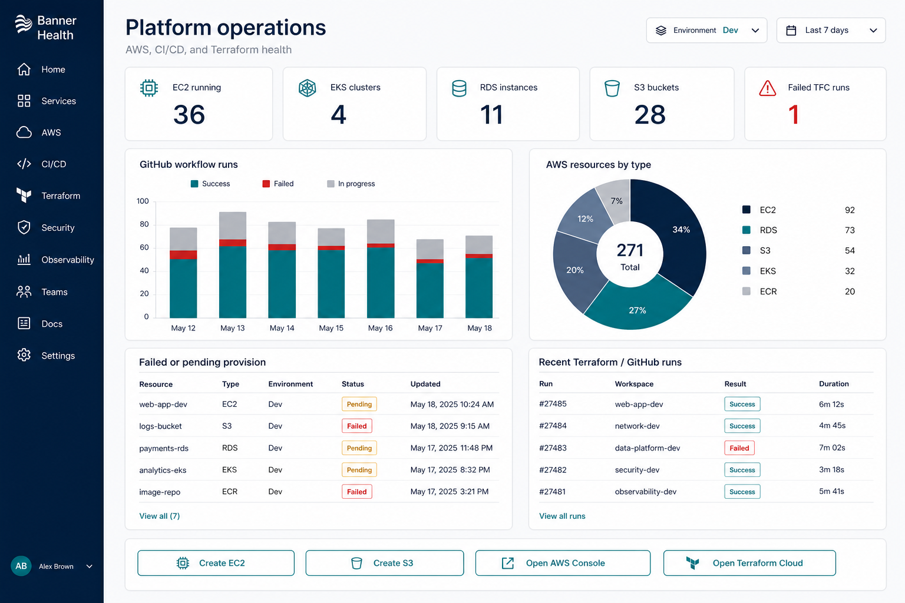
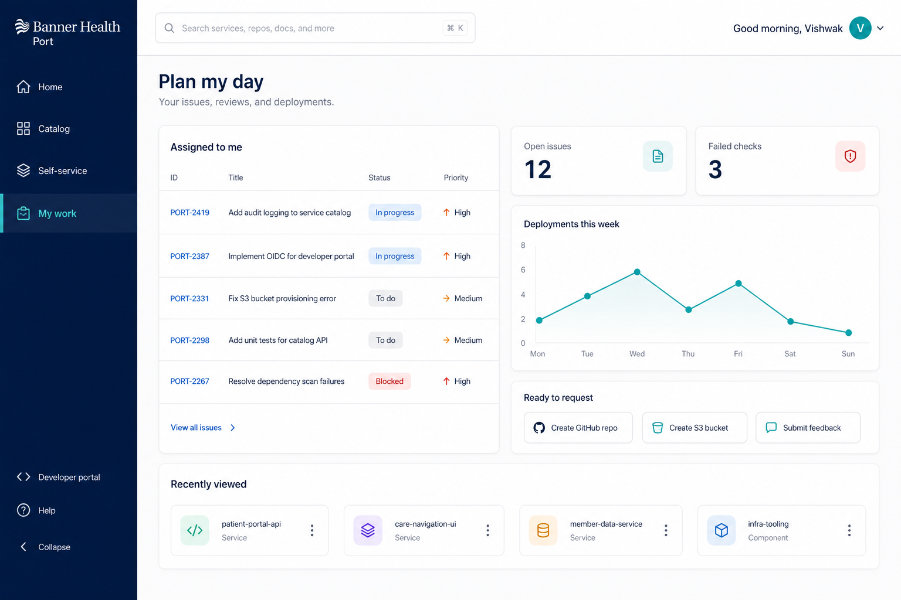

# BannerHealth Port landing dashboard — initial wireframe

**Status:** Design lock (not yet implemented in Port)
**Audience:** Developers, platform/cloud engineers, team leads
**Goal:** Replace the current Home "setup" page with a Dynamics-style cockpit: quick links, KPI tiles, charts, pending work, and the most-used self-service actions.

The Home page in Port **is already a dashboard**. We do not need a new product. We rearrange widgets on `$home`, then add a couple of catalog dashboards later if we want role-specific views.

**Working layout (widget inventory):**



**Recommended client look (use this in the review):**



> Numbers in the mocks are illustrative. Live tiles will count real catalog entities. Visual styling is the target; Port widgets will be slightly more compact than these mocks.

---

## 0. Client-ready options (pick one Home, optional extra pages)

Show the overview slide first, then the recommended Home. Do not present five competing Homes — present **one recommended landing page** and two optional pages.



| Option | File | Who it is for | Recommend for Sept 11? |
|---|---|---|---|
| **A. Executive Home** | `assets/port-home-executive.png` | Everyone who opens Port | **Yes — this is v1** |
| **B. Platform operations** | `assets/port-platform-ops.png` | Cloud / platform engineers | Optional second page if they want it before the 11th |
| **C. Plan my day** | `assets/port-engineering-work.png` | Developers / app teams | Later — Port already has this page; restyle it after Home |

### Option A — Executive Home (recommended)

Navy + teal, more whitespace, fewer widgets than the first wireframe. Same content, calmer presentation:

- 6 quick links (Hub, Plan my day, Scorecards, EC2, Jira, GitHub)
- 4 KPI tiles with a colored left edge (pending, failed runs, open problems, active EC2)
- Donut: requests by status
- Table: needs attention
- Personal lists at the **bottom** so empty states do not dominate

This is the one to put on the projector. It looks like a finished healthcare IT product, not a demo.

### Option B — Platform operations (optional page)



Separate catalog dashboard, not a replacement for Home. Environment filter, AWS counts, GitHub run chart, resource mix, failed provision table, TFC/GitHub runs, outlined actions (Create EC2 / S3, open AWS, open TFC). Build this only if they explicitly want a platform page by the 11th.

### Option C — Plan my day (developer page)



Personal work: assigned Jira, open issues, failed checks, deployments this week, a few request shortcuts. Port already has Plan my day in the org nav. Do not rebuild it for v1; link to it from Home.

**If they ask “which looks most professional?”:** Option A. The first wireframe is the inventory of widgets; Option A is how those widgets should feel.

---

## 1. What is wrong with Home today

The current Home is a **configuration checklist**, not a place to work:

| Current widget | Problem |
|---|---|
| Quick Access: Set up catalog / ownership / discovery | Catalog and integrations already exist. These links train people to think Port is unfinished. |
| My entities | Empty — ownership relations are not populated, so this widget has nothing to show. |
| Recently viewed | Useful, but it is the only real content. |
| Recently used actions | Only "Submit Feedback". |
| Self-service action | Broken: "The action that was here no longer exists." |

The catalog already has AWS, GitHub, Jira, Dynatrace, Terraform, and self-service actions. Home just does not surface them.

---

## 2. Design principle (Dynamics → Port)

Sanjay asked us to look at Dynamics dashboards. Same pattern, Port widgets:

| Dynamics 365 | Port widget | What it is for |
|---|---|---|
| Sitemap / quick create | **Links** + **Action card** | Get somewhere, or do something, in one click |
| KPI tiles | **Number chart** | One number that can be drilled into |
| Charts | **Pie / bar / line** | Mix of statuses and trends |
| Views / grids | **Table** | Rows that need attention |
| IFrame / Power BI | **Iframe** (phase 2) | Embed TFC, Dynatrace, or Grafana later |
| Personal views | **My entities / recently viewed / recently used actions** | Home-only, per user |

Rule for Home: **scan in 10 seconds, act in 2 clicks.** Full create/delete catalogs stay on Self-Service Hub. Home only promotes the 4 most-used actions plus a link to the hub.

---

## 3. Layout (top to bottom)

Port layout is a 12-column grid. Proposed rows:

```text
Row 1  [ Quick Links          8 cols ] [ Welcome markdown  4 cols ]
Row 2  [ KPI ] [ KPI ] [ KPI ] [ KPI ]     (3 cols each)
Row 3  [ Pie: requests by status  6 ] [ Bar: GitHub runs 7d  6 ]
Row 4  [ Action cards: Request something  4 ] [ Table: Needs attention  8 ]
Row 5  [ My entities 4 ] [ Recently viewed 4 ] [ Recently used actions 4 ]
```

Optional later row (only if data is populated): Dynatrace problems table + open Jira issues for my team.

### 3.1 Quick Links (must-have)

Use Port's **Links** widget. Internal links stay in Port; external links open a new tab.

**Put these 8 on Home:**

| # | Label | Type | Destination | Why it is on Home |
|---|---|---|---|---|
| 1 | Self-Service Hub | Internal | `/self-serve` | Primary "I need to request something" |
| 2 | Plan my day | Internal | `/plan_my_day` | Already in org nav; personal work |
| 3 | My team's work | Internal | team work page | Leads / managers |
| 4 | Scorecards | Internal | comply-with-standards / scorecards | Governance without hunting the sidebar |
| 5 | EC2 catalog | Internal | EC2 Instances catalog table | Most visible AWS footprint |
| 6 | Jira Issues | Internal | Jira Issue catalog table | Work tracking already ingested |
| 7 | GitHub Runs | Internal | GitHub Workflow Runs table | CI health |
| 8 | Submit Feedback | Internal | Feedback action / entity | Already used; keep it obvious |

**Do not put on Home** (keep in Hub or sidebar): every create/delete card (ECR, KMS, EBS, Secrets, LB, S3 deletion). Home is a launch pad, not a second Self-Service Hub.

**Optional second Links widget** titled "Platform consoles" (right rail or a small markdown list):

| Label | External URL (confirm with platform team) |
|---|---|
| AWS Console | `https://console.aws.amazon.com` |
| Terraform Cloud | `https://app.terraform.io` |
| GitHub | BannerHealth GitHub org |
| Jira | BannerHealth Jira site |
| Dynatrace | BannerHealth Dynatrace tenant |
| Microsoft Teams | Teams |

### 3.2 Welcome markdown

Short, not a wiki. Example copy:

```markdown
### Welcome to the developer portal

Request AWS and GitHub resources, track approvals, and see what is failing.

- **Need infrastructure?** Use Request something below, or open Self-Service Hub.
- **Waiting on approval?** Check Needs attention.
- **Something broken?** Open GitHub Runs or Dynatrace problems.
```

Remove all "Set up service catalog / ownership / discovery" links.

### 3.3 KPI tiles (number charts, drill-down on)

| Tile | Catalog table (blueprint) | Count rule | Color intent |
|---|---|---|---|
| Pending approvals | EC2 Change Request (`ec2ChangeRequest`) | `approvalStatus = pending` | Amber — action needed |
| Failed workflow runs | GitHub Workflow Runs | `conclusion/status = failure` (last 7 days if timestamp exists) | Red |
| Open Dynatrace problems | Dynatrace Problem | status open / active | Red |
| Active EC2 instances | EC2 Instances **or** Terraform-managed EC2 | state = running / in-service | Neutral / teal |

If Dynatrace is sparsely populated, swap tile 3 for **Open Jira bugs** (`issuetype = Bug`, `statusCategory != Done`).

Each number chart should drill into a filtered table of those entities.

### 3.4 Charts

| Chart | Type | Blueprint | Split by |
|---|---|---|---|
| Self-service requests by status | Pie | `ec2ChangeRequest` (and S3 Bucket `status` as a second pie if volume is enough) | `approvalStatus` or `executionStatus` |
| GitHub workflow runs (7 days) | Bar | GitHub Workflow Run | success / failure / in progress |
| AWS resources by type | Pie (phase 1b) | Cloud Resource **or** one chart per major type if there is no parent blueprint | EC2 / RDS / EKS / S3 / ECR |

### 3.5 Action cards — "Request something"

One **Action card** (or workflow card) with **four** actions only:

1. Create / provision EC2 instance
2. Create S3 bucket
3. Create GitHub repository
4. Submit Feedback

Everything else stays on Self-Service Hub. Fix or delete the broken "action that no longer exists" widget.

### 3.6 Table — "Needs attention"

For the Sept 11 date, **do not** invent a new unified "work item" blueprint. Use **2–3 filtered tables** stacked or tabbed by type:

| Table | Blueprint | Default filter | Columns |
|---|---|---|---|
| Pending EC2 approvals | `ec2ChangeRequest` | `approvalStatus = pending` | instanceName, environment, requestedBy, approvalStatus, executionStatus |
| Failed / pending S3 | `s3Bucket` | `status in (pending, failed)` | bucketName, environment, region, status |
| Failed GitHub runs | GitHub Workflow Run | failed | name, conclusion, createdAt, related repo |

If we later add a `selfServiceRequest` blueprint, this can become one table. That is a follow-up, not a blocker.

### 3.7 Personal widgets (keep, but after real work)

Keep Port's Home-only widgets, **below** KPIs and actions so empty states do not dominate:

- My entities
- Recently viewed
- Recently used actions

Empty state for My entities should say: "Nothing owned by you yet. Ownership is being mapped from GitHub/Jira teams." — not the current blank placeholder.

---

## 4. What data comes from which table

Identifiers below use **catalog titles from the current BannerHealth-Dev sidebar**. Confirm exact blueprint IDs in Builder → Data model before wiring widgets.

### 4.1 Already usable for Home (phase 1)

| Widget | Table / blueprint | Attributes to show / aggregate | Filter |
|---|---|---|---|
| KPI: Pending approvals | EC2 Change Request | `approvalStatus`, `instanceName`, `requestedBy`, `environment` | pending |
| KPI: Active EC2 | EC2 Instances / Terraform-managed EC2 | instance state, type, environment, region | running |
| KPI: Failed runs | GitHub Workflow Runs | `conclusion` / `status`, `createdAt`, workflow name | failure |
| Pie: request status | EC2 Change Request | `approvalStatus` or `executionStatus` | none (or last 30 days) |
| Action cards | Existing self-service actions | — | — |
| S3 health table | S3 Bucket (`s3Bucket`) | `bucketName`, `environment`, `region`, `status` | pending/failed |
| Jira link + optional KPI | Jira Issue | `status`, `issuetype`, `assignee`, `priority` | open, my team |
| Dynatrace KPI | Dynatrace Problem | severity, status, entity | open |

### 4.2 Nice on Home only if data is populated

| Table | Why it might be empty today |
|---|---|
| My entities | No `ownedBy` / team relation on AWS and GitHub entities |
| Deployments | Need relation to GitHub Workflow Run + service |
| RDS / EKS / ECR counts | Fine as extra KPIs once we confirm entity volume |
| Jira Sprints / Worklogs | Better on a "My team's work" dashboard than Home |
| AI Agent / Conversation | Leave off Home until the AI Assist use case is defined |

### 4.3 Missing relationships to create (phase 2 — needed for filters and "my team")

These are the gaps the implementation plan called out. Home v1 can ship without all of them; "my team" filters cannot.

| From | To | Relation purpose |
|---|---|---|
| Team / Group | Service (or Cloud Resource) | Ownership — fills My entities |
| Service | GitHub Repository | Code → catalog |
| Service | Jira Project | Work → catalog |
| Service | EKS Cluster / RDS / S3 | Runtime footprint |
| EC2 Instance | Security Group, Subnet, AMI, EBS Volume | Blast radius |
| EC2 Change Request | EC2 Instance | Request → provisioned resource (`instanceId`) |
| S3 Bucket | Terraform workspace / Environment | TFC repo Farida mentioned |
| Deployment | GitHub Workflow Run | Ship status |
| GitHub Workflow Run | GitHub Workflow → Repository | Drill from failed run to repo |

Until ownership exists, dashboard filters should use **Environment** and **Team** where those properties already exist on the blueprint (`environment` is already on `s3Bucket` and `ec2ChangeRequest`).

### 4.4 Filters and policies

| Layer | What to implement | Notes |
|---|---|---|
| Dashboard filter | Environment = dev / qa / prod | Applies across widgets that share that property |
| Widget filter | Status, conclusion, approvalStatus | Per widget |
| Page permissions | Home visible to all authenticated users | Default |
| Team scope | "My team's work" page, not Home v1 | Needs ownership relations |
| Action permissions | Keep current self-service RBAC | Do not widen who can create prod EC2 from Home |

---

## 5. Recommended page set (not only Home)

| Page | Type | Who | When |
|---|---|---|---|
| **Home** (`$home`) | Dashboard | Everyone | Phase 1 — by the 11th |
| **Platform ops** | Dashboard | Cloud / platform | Phase 1b — AWS counts, TFC, failed runs |
| **Engineering work** | Dashboard | App teams | Phase 2 — Jira + GitHub + Plan my day widgets |
| Catalog tables | Existing | Everyone | Keep; Home links into them |

Do not rebuild Self-Service Hub. It is already the right "create/delete" surface.

---

## 6. Build sequence (matches the process already agreed)

1. **Lock this wireframe** — which 8 links, which 4 KPIs, which 4 actions.
2. **Inventory** — export blueprint identifiers, property names, and entity counts (especially GitHub Run, Dynatrace Problem, EC2, Jira Issue). Drop any KPI whose table is empty.
3. **Attributes** — confirm enums (`approvalStatus`, `executionStatus`, S3 `status`, workflow `conclusion`).
4. **Filters / policies** — Environment filter on Home; leave team-scoped RBAC for phase 2.
5. **Relationships** — start with Request → resource and Team → resource; do not block Home v1 on a full service graph.
6. **Implement Home in Port (dev)** — Links, markdown, number charts, pie/bar, action cards, tables, personal widgets. Remove setup links and the broken action widget.
7. **QA** — promote via existing GitOps (`dev` → `qa`) once pages are in Git.
8. **Production** — `qa` → `main` after QA sign-off.

Home v1 does **not** require GitOps pages support on day one. It can be built in the Port UI on the Home page, then exported to JSON. Follow-up: add `pages` to `scripts/apply_port_config.py`.

---

## 7. What we need decided in the design review

Please confirm or change:

1. The 8 Home quick links in section 3.1.
2. The 4 KPI tiles in section 3.3 (or swap Dynatrace for Jira).
3. The 4 Home actions (EC2, S3, GitHub repo, Feedback) vs adding KMS/ECR.
4. Whether "Platform consoles" (AWS, TFC, GitHub, Jira, Dynatrace) belong on Home or only in the sidebar.
5. Whether Home is one page for all roles, or we also stand up a Platform ops dashboard before the 11th.

Once those five items are locked, implementation can start immediately.
